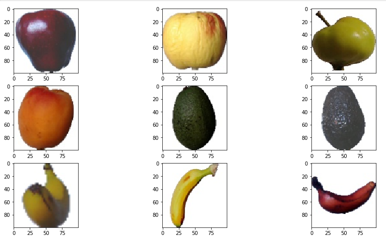
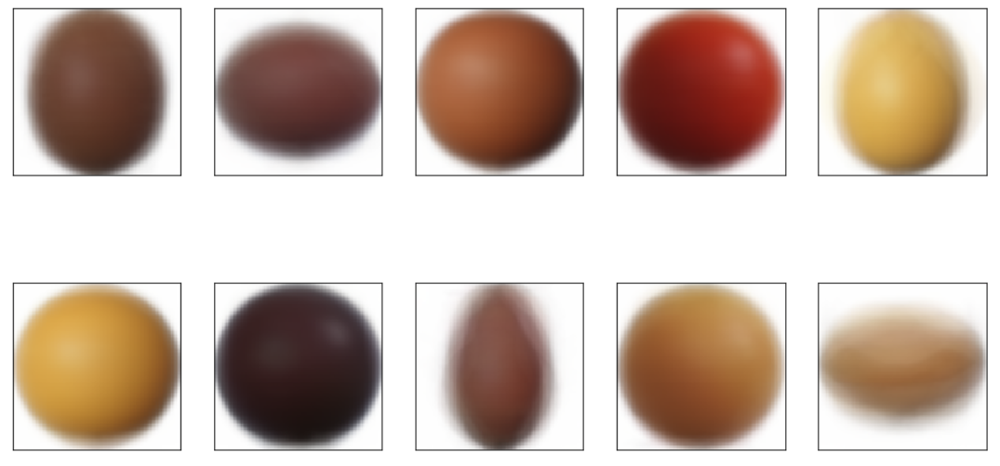

# IMAGE_DATASET_CLUSTERING_USING_K-Means

# K-Means
    This is a unsupervised machine learning algorithm in which similar data points is
    clustered based on the features. 

# Dataset
https://www.kaggle.com/moltean/fruits
    
    Total number of images: 80653.
    Training set size: 60318 images (one fruit or vegetable per image).
    Test set size: 20232 images (one fruit or vegetable per image).
    Multi-fruits set size: 103 images (more than one fruit (or fruit class) per image)
    Number of classes: 118 (fruits and vegetables).
    Image size: 100x100 pixels.

# Result

